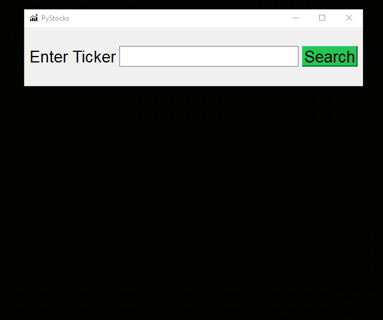

# PyStocks
See info on stocks! This project is built with Python/PyQt5 and Matplotlib. Type in a stock ticker to get started and see data/charts.

# How It Works:
There are three Python scripts used to make this all work. One is the GUI script, another fetches stock data and the last converts a ticker to the actual name of the company. Furthermore, when a stock ticker is inputted to the GUI, it sends it to the yfinance script which returns all the info that is displayed on the GUI. Several modules tie this all together, including:
1. PyQt5 - This is the GUI module, which helps create the program, buttons, etc.
2. yfinance - Yahoo Finance's API to get stock data when given a ticker name. Helps with the backend of the data
3. Pandas and numpy - Creates and reads CSV files which contain the price of a stock every day going one year back. This data is used to display the graph and do statistics.
4. Matplotlib - Creates the stock graph with a line graph.

# GIF: 

